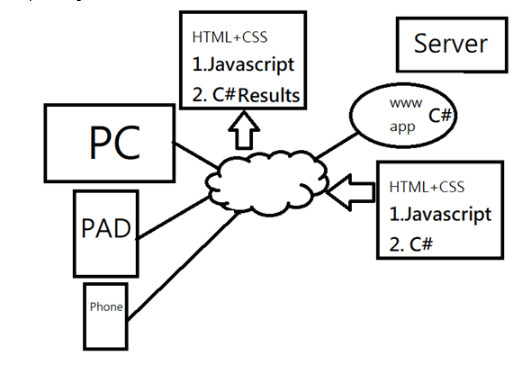

## csjou-hwu/js1082
### js1082

## 第1週課程摘要(Mac OP/asp.net core sdk download/Console/Web/UseUrls)
### 程式基本概念

### Mac 電腦基本操作與Windows作業系統比較
### wk0101 C#程式基本架構與建立指令
dotnet new console -o wk0101  
cd wk0101  
dotnet run  
### 輸入語法
string a1 = Console.ReadLine(); 
### 伺服器程式
dotnet new web -o wk0102 
cd wk0102  
dotnet run  
### 固定網址設定與個人手機連線

## 第2週課程摘要
### asp.net core
### UseUrls
### html架構
### aframe.io架構
### 3D Basic

## 第3週課程摘要
### asp.net core
### web
### html
### CSS
### javascript basic

## 第4週課程摘要
### document.createElement()
### I/O/for/if/3D

## 第5週課程摘要
### 3D concept
### tag vs js
### js loop
### shapes

## 第6週課程摘要
### animation
### position/rotation/color
### tag vs js
### multiple animation

## 第7週課程摘要
### VR cursor
### mouseenter startEvents
### % operator
### cylinder coordinate

## 第8週課程摘要
### light
### a-obj-model
### tag vs javascript loop

## 第10週課程摘要
### html a tag
### a-text
### click event
### custiom font

## 第11週課程摘要
### html vs a-text with click
### 中文字形
### loop add events

## 第12週課程摘要
### w3schools mobile simulator
### a-text + click menu-double loop
### razor template

## 第13週課程摘要
### razor
### page3
### wwwroot
### page4 C# vs javascript

## 第14週課程摘要
### razor + aframe
### drv.tw www.js1082.io
### shorturl.at
### qrcode

## 第15週課程摘要
### drv.tw
### ar + 3D animation
### videosphere

## 第16週課程摘要
### a-videosphere
### javascript vs aframe tag
### drv.tw qrcode

## 第17週課程摘要
### SPA
### Razor
### drv.tw
